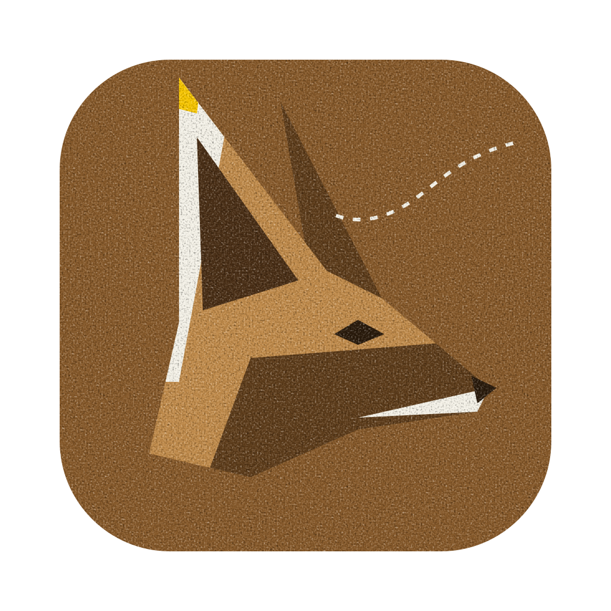

<table width="100%">
	<tr>
		<td colspan="2" align="center" style="padding: 24px 12px;">
			 
			<strong><em>Straight to the useful part.</em></strong>
		</td>
	</tr>
	<tr>
		<td colspan="2" align="left" style="padding: 0;"></td>
	</tr>
	<tr aria-hidden="true">
		<td></td>
		<td></td>
	</tr>
	<tr>
		<td align="left" width="190"><strong><a href="https://github.com/Jam-Sw/InstantNotes#readme-ov-file">InstantNotes</a></strong> </td>
		<td align="right" style="font-size: 1.1em; padding: 14px 12px;">Quickly capture your ideas & organize your thoughts, knowledge grows.</td>
	</tr>
	<tr>
		<td align="left" width="190"><strong><a href="https://github.com/Jam-Sw/lineage#readme-ov-file">Lineage</a></strong> </td>
		<td align="right" style="font-size: 1.1em; padding: 14px 12px;">Your lifetime of code on GitHub, visualized.</td>
	</tr>
	<tr>
		<td align="left" width="190"><strong><a href="https://github.com/Jam-Sw/fennec#readme-ov-file">Fennec</a></strong> </td>
		<td align="right" style="font-size: 1.1em; padding: 14px 12px;"> Real Time Voice Transcription (speak into claude) (MacOS)</td>
	</tr>
	<tr>
		<td align="left" width="190"><strong><a href="https://github.com/Jam-Sw/img2text#readme-ov-file">img2text</a></strong> </td>
		<td align="right" style="font-size: 1.1em; padding: 14px 12px;">Tool for images & GIFs conversion into text art, ASCII, pixels, more.</td>
	</tr>
</table>

See More

[Report a security issue](https://github.com/Jam-Sw/.github/blob/main/SECURITY.md).

